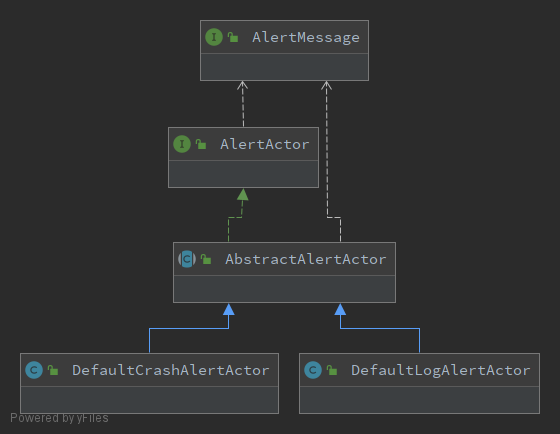

# Alert 告警API的设计

Alert支持各种快捷灵活方式的告警API，避免过程式的调用告警service

### 问题背景

在项目中，可能许多时候会遇到需要发送一些告警信息的情况，例如打印ERROR日志，发送EMAIL告警。

通常方式可能在需要的地方直接`Log.error(...)`或者写一个发送Email的service，直接调用`service.sendEmail(...)`这样的方式。

但在告警形式、告警位置增多的情况下，需要调用的告警service类快速增加，从而可能导致代码混乱。

同时，这也是一种过程式的调用方式，每个项目都需要定制自己的告警service，然后再手动的注入、调用；即时是同步异步的方式，也需要手动指定。

### 解决思路

针对背景问题，首先思考以下几个问题：

1. 如何避免过程式的调用告警service
2. 如何进行抽象，从而在不同项目中，使用同样的告警API。对于具体实现的不同，可以进行独立封装，并不影响调用方式
3. 如何引入动态配置化，避免每个service都需要实现自己的动态配置功能，提供统一的告警动态配置
4. 如何提供方便扩展的代码结构，能够快速实现自定义功能

在实践过程中，Alerts模块针对以上问题，参考AKKA-Actor系统的设计思路，大致确定了以下的解决思路：

1. 对外提供统一的、唯一的告警API调用入口，具体处理逻辑由传入的参数类型进行推导路由。从而避免直接调用`a.alert(...); b.alert(...)`这样的过程式方法，将系统间的不同实现封装到泛型参数中
2. 提供统一的动态配置功能，同时该配置封装在Alerts模块内部，不需要外部调用方参与。从而实现了与外部系统的解耦，可以在模块内部配置实现方式，例如同步异步等
3. 自定义逻辑通过实现接口进行拓展，通过默认的spring-context的接口扫描功能，能够将自定义的actor注入到Alerts的管理容器之中，实现基于配置的动态拓展
4. 参考AKKA-actor系统的结构，通过类型绑定告警消息message和告警逻辑执行者actor，实现自动的路由绑定

#### Actor结构图：



#### Alert时序图：


### Spring上下文配置

Alerts模块作为第三方库，没有办法直接通过配置注解的方式注册bean到外部系统的spring上下文中。

这里采用了spring的SPI机制，通过`spring.factories`配置文件的方式，将默认的actor注册到外部系统的spring上下文中。

### 用例演示

定义自定义告警message并绑定到自定义告警执行者actor。

通过`Alerts.tell(message)`将警报message告知警报执行者actor。

然后在`actor.onReceive(message)`中处理告警message。

```java
/**
 * 告警API的演示.
 */
public class AlertsTest {

    /**
     * 定义自定义的 {@code alert actor} 然后注册到上下文当中，例如在spring中使用 {@link Component} 的方式.
     * 继承 {@link AbstractAlertActor} 并绑定具体的告警消息类型.
     */
    @Component
    public static class TestAlertActor extends AbstractAlertActor<TestAlertActor.TestAlertMessage> {

        /**
         * 定义自定义的 {@code alert message}，并绑定到具体的actor中.
         * 需要实现 {@link AlertMessage} 接口，从而能够被 {@link AlertActorSystem} 接收.
         */
        @Data
        @AllArgsConstructor
        public static class TestAlertMessage implements AlertMessage {
            private final String message;
        }

        /**
         * 接收 {@code alert message} 并执行具体处理逻辑.
         */
        @Override
        protected void onReceive(TestAlertMessage message) {
            System.out.println(message.getMessage());
        }
    }

    /**
     * 将 {@code default log alert message} 发送给 {@code default log alert actor}.
     * 将会通过 {@link Slf4j}打印不容日志等级的告警日志信息.
     */
    public void tellDefault() {
        // 发送默认的日志消息
        Alerts.tell(new DefaultLogAlertActor.DefaultLogAlertMessage("alert with error level"));
        // 发送带有日志等级的消息
        Alerts.tell(new DefaultLogAlertActor.DefaultLogAlertMessage("alert with error level", DefaultLogAlertActor.AlertsLogLevelType.ERROR));
        Alerts.tell(new DefaultLogAlertActor.DefaultLogAlertMessage("alert with warn level", DefaultLogAlertActor.AlertsLogLevelType.WARN));
    }

    /**
     * 将 {@code custom alert message} 发送给 {@code custom alert actor}.
     * 将会在 {@code AbstractAlertActor#onReceive(AlertMessage)} 中执行处理逻辑
     */
    public void tellCustom() {
        Alerts.tell(new TestAlertActor.TestAlertMessage("TEST"));
    }

    /**
     * 使用自定义背景更换Spring上下文。 
     * 将 {@code custom alert message} 发送给 {@code custom alert actor}.
     */
    @Deprecated
    public void tellWithCustomContext() {
        // 使用自定义context，而非默认的spring-context
        initCustomContext();
        Alerts.tell(new TestAlertActor.TestAlertMessage("TEST"));
    }

    @Deprecated
    private void initCustomContext() {
        // 使用自定义context
        Vrml.builder()
                .useCustomConfig()
                .build();
        // 设置自定义的actor容器
        AlertActorSystem.setCustomActorContainer(Collections.singletonList(new TestAlertActor()));
        // 设置自定义的告警API配置
        AlertActorSystem.setCustomConfiguration(new AlertConfiguration() {
            @Override
            public boolean isAlertAsync() {
                return false;
            }

            @Override
            public boolean isAlertEnable(AlertMessage message) {
                return true;
            }
        });
    }
}
```

#### 举例：通过告警API发送Email告警消息

```java
// 定义你的Email告警逻辑处理者actor，并绑定Email告警消息类型
public class EmailAlertActor extends AbstractAlertActor<EmailAlertMessage> {
    @Override
    protected void onReceive(EmailAlertMessage message) {
        // 在这里发送Email的逻辑
    }
}

// 定义Email告警消息的具体内容
public class EmailAlertMessage implements AlertMessage {}

// 通过告警API发送Email告警信息
Alerts.tell(new EmailAlertMessage(...));

// Email告警逻辑处理者将会接收此信息，然后执行你的Email发送逻辑
EmailAlertActor.onReceive(message);
```

### Maven

```xml
<dependency>
  <groupId>group.rxcloud</groupId>
  <artifactId>vrml-alert</artifactId>
  <version>1.0.8</version>
</dependency>
```